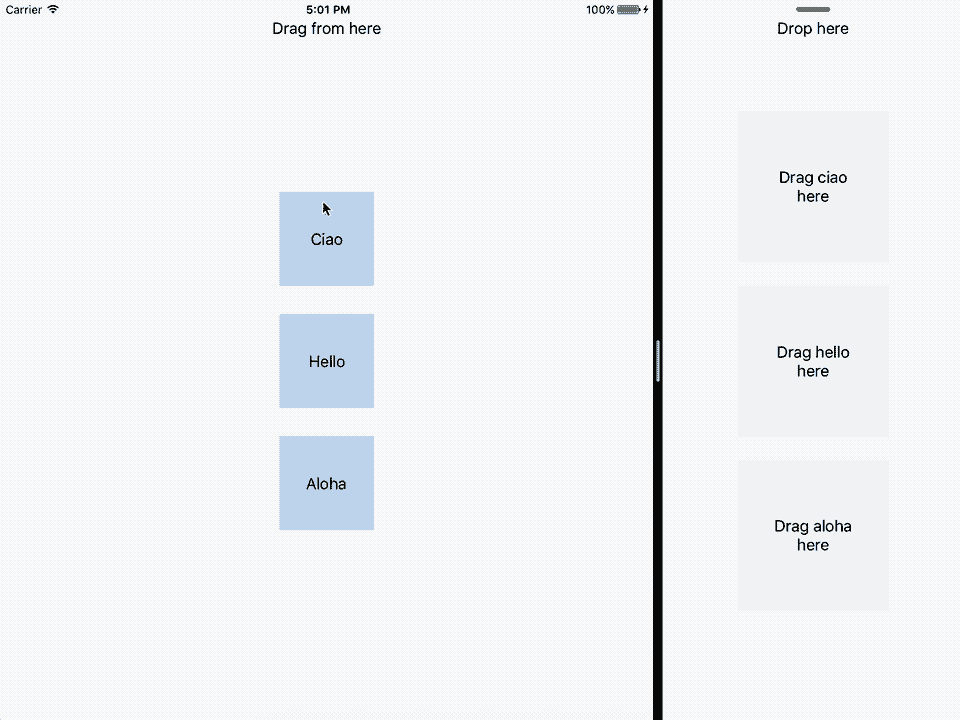

# SplitViewDragAndDrop
Easily add drag and drop to pass data between your apps

[](https://developer.apple.com/iphone/index.action)
[](https://developer.apple.com/swift/) 



# Setup
- Copy the "SplitViewDragAndDrop" folder into your project
- Make sure to call 
```SplitViewDragAndDrop.configure(groupIdentifier: <YOUR-APP-GROUP-ID>)``` in ```application:didFinishLaunchingWithOptions:```. **Your apps must share that app group in order to communicate**.
- Configure the view you want to drag with ```SplitViewDragAndDrop.handleDrag(viewToDrag: <THE-DRAGGABLE-VIEW>, identifier: <AN-IDENTIFIER>, dataToTransfer: <SOME-DATA-TO-TRANSFER>)``` 
  where 
  - **viewToDrag** is a UIView and it will be snapshotted and dragged around
  - **identifier** is a string rappresenting an unique identifier.
  - **dataToTransfer** is a Data, it could be an image, a pdf ecc..
 - Configure the drop observer with  
   ```
   SplitViewDragAndDrop.addDropObserver(
    targetView: <A-TARGET-VIEW>,
    identifier: <AN-IDENTIFIER>,
    draggingBegan: { frame, draggedViewSnapshotImage, dataTransfered in
      // the drag is began, here you can perform some ui changes in order to tell the user where to drag the item
    },
    draggingValidation: { frame, draggedViewSnapshotImage, dataTransfered in            
      return <A-BOOL>
    },
    completion: { frame, draggedViewSnapshotImage, dataTransfered, isValid in
      // the drag is complete and you can use dataTrasfered if you want
    }
   )
   ```
    where 
    - **targetView** is a UIView and it will be the center of the dragged item when the user end the dragging and the validation succedded
    - **identifier** is a string rappresenting an unique identifier
    - **draggingBegan** is a closure that will be called when the drag is began
    - **draggingValidation** is a closure that will be called when the drag is ended. You have to return a value that indicate if the drag is valid or not. If that value is true, the dragged view will be moved to the center of the **targetView**, otherwise it will be moved back to it's original position.
    - **completion** is a closure that will be called after the validation.
     
# Demo
In this repository you can also find a demo.

# Info
If you like this git you can follow me here or on twitter :) [@MarioIannotta](http://www.twitter.com/marioiannotta)

Cheers from Italy!
